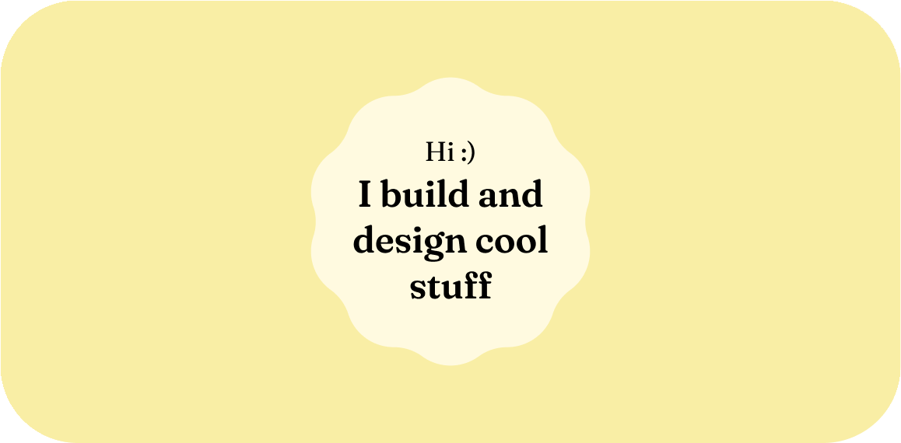

🙋‍♂️<br>I'm Cervon Wong, currently studying my fifth year in NUS High. I build and design meaningful and enjoyable products that solve real-world problems.

### About me
 - 1️⃣ I try to contribute to issues, discussions, and documentation of random open-source projects that I love to use.
 - 2️⃣ Most of my projects on GitHub are user-facing educational or informational apps and websites.
 - 3️⃣ When I'm not working on projects, you'll probably find me learning (spoken) languages.
 - 4️⃣ My long-term goal is to be able to use my learnt skills to advance technology for society.

Programming language preference: Dart > Kotlin > Python > Java > C++
<br>
Spoken language proficiency: English > Chinese > Japanese > Toki Pona > French

### Things that I am exploring
 - 🤖 Robotics
 - 🔐 Cybersecurity
 - 📊 Web analytics / data analysis

***

My education, selected projects, awards and technical skills—summarised for you neatly in a one-page PDF. 👉 [View my resume](https://cervonwong.com/resume).

```
           __n__n__   ,--------,
    .------`-\00/-'   |   Hi   | 
   /  ##  ## (oo)    <_________/ 
  / \## __   ./
     |//YY \|/
     |||   |||
```

***

[](https://github.com/cervonwong)
